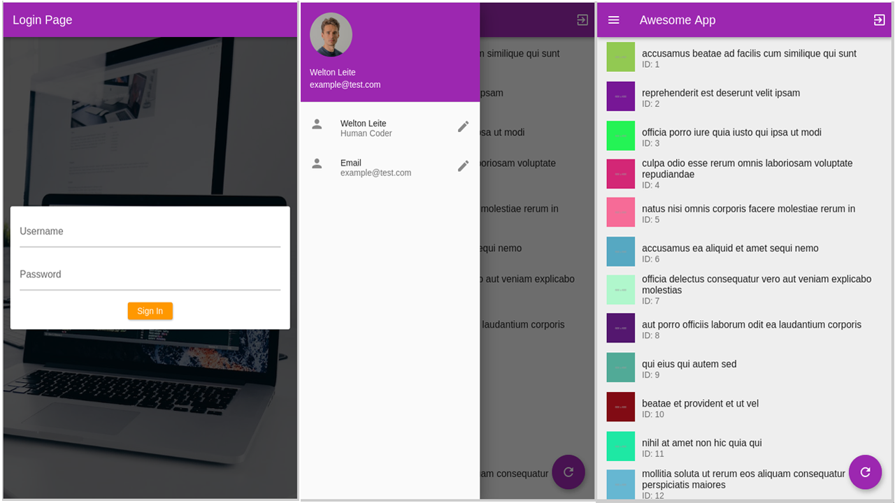

# freeCodeCamp Flutter Essentials
## Flutter
Flutter is a UI software development kit from Google that allows developers to build natively compiled applications for mobile, web, and desktop from a single codebase.

### freeCodeCamp Flutter Essentials
freeCodeCamp released a [Flutter Essentials course](https://www.youtube.com/watch?v=P2IGQT3BZQo) on the freeCodeCamp.org [YouTube channel](https://www.youtube.com/@freecodecamp). This beginner's course will teach you everything you need to know to get started building apps with [Flutter](https://flutter.dev/). The course was created by MTechViral.

Flutter uses the [Dart programming language,](https://dart.dev/) but prior Dart experience is not required to watch this course. It would be helpful to have expereince with at least one other programming language, though.

#### Demo


#### Topics
Some of the Flutter topics discussed in this course:
- Installation
- Container & Text Widgets
- Rows & Columns
- Material Drawer
- ListView
- Circle Avatar
- NetworkImage
- Floating Action Button
- Card, Asset Images, TextField & ScrollView
- Organising Your Flutter Code
- Networking with HTTP
- ListView Builder
- GridView Builder
- Forms, Stack & Navigation
- Persistent Storage with Shared Preferences

## Getting started
**Follow the steps below**
```bash
# Requirements:
# Dart and Flutter installed

# Clone the project and access the folder
git clone https://github.com/wwwwelton/flutter-essentials-freecodecamp && \
cd flutter-essentials-freecodecamp/awesome_app/

# Install dependencies
flutter pub get

# Run app
# To run natively:
flutter run
# To access by link address in any browser:
flutter run -d chrome --web-renderer html --hot

# Clean the downloaded dependencies and build files
flutter clean

# Well done!
```

## 📝 License

This project is licensed under the GNU General Public License v3.0 - see the [LICENSE](LICENSE) file for details.

---

Made by: Welton Leite 👋 [See my linkedin](https://www.linkedin.com/in/welton-leite-b3492985/)
